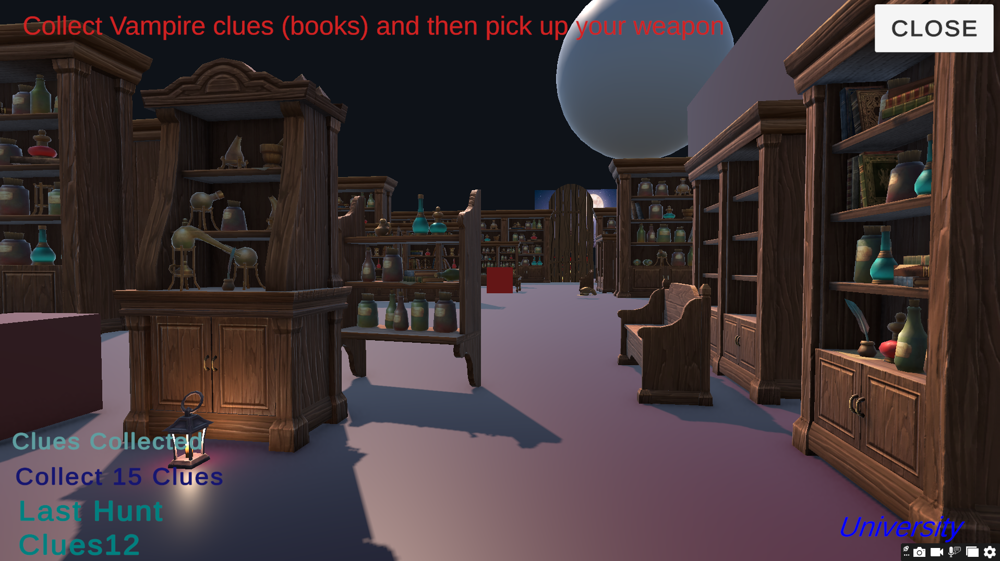
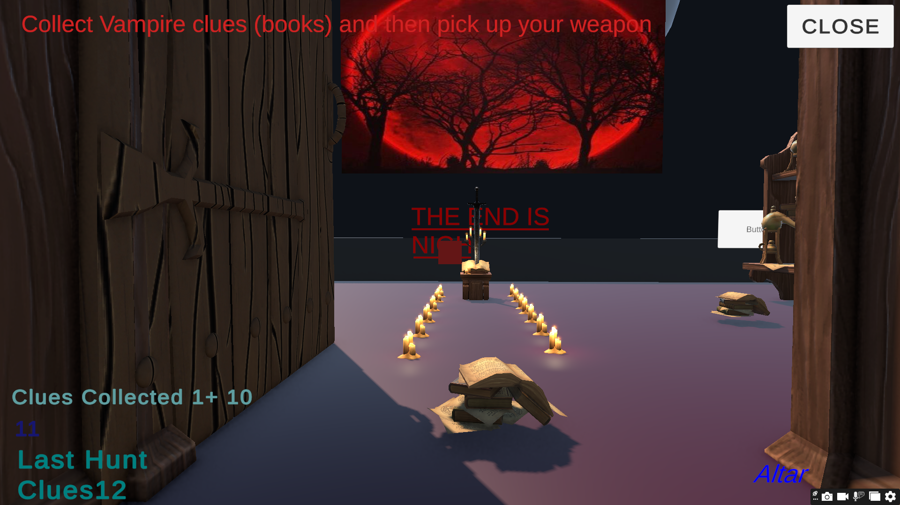
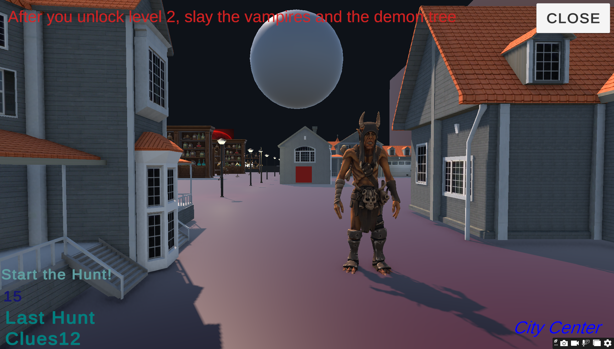
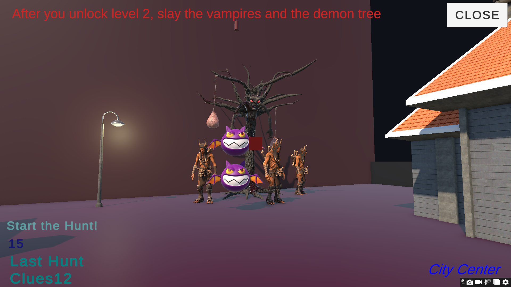
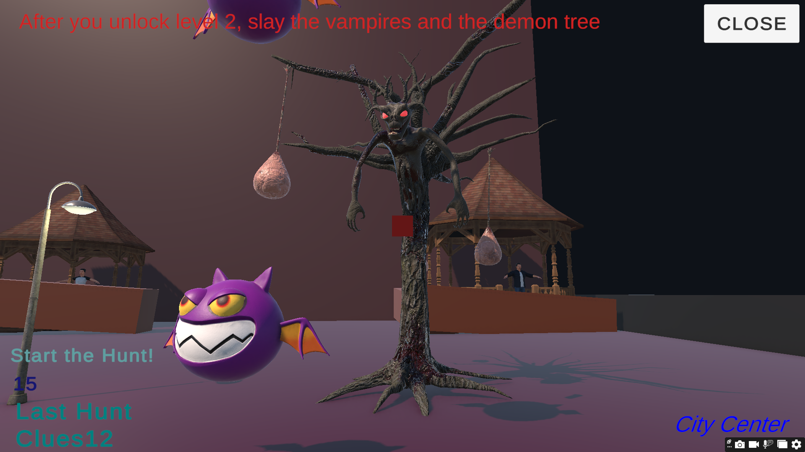
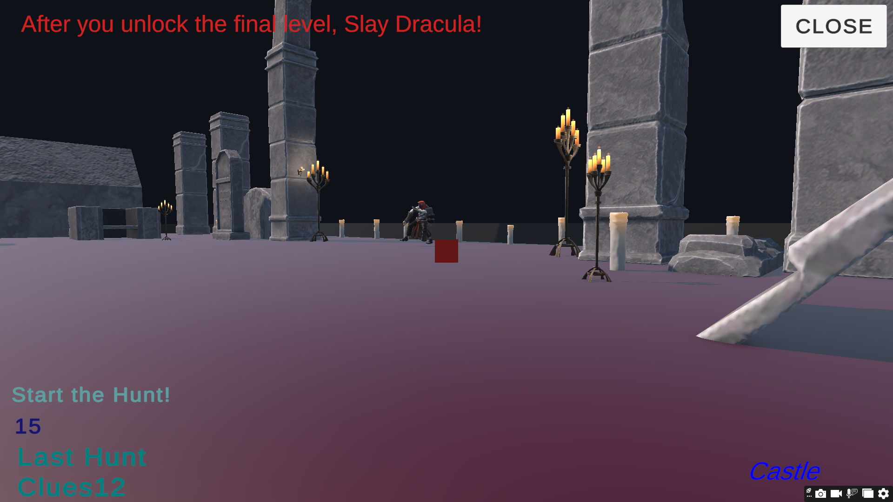
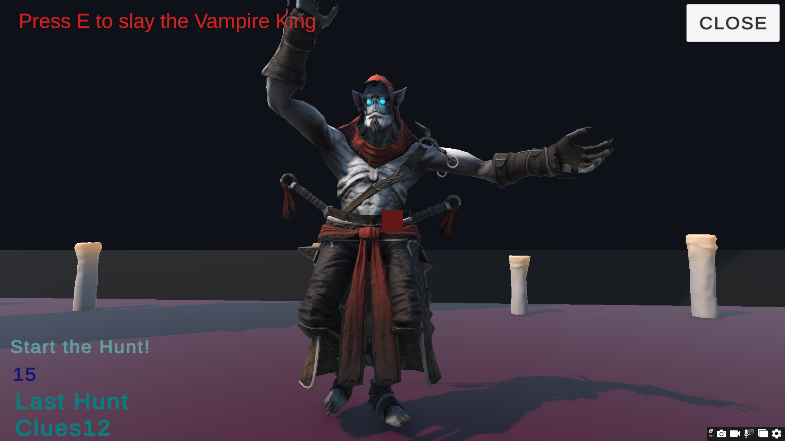

# Bloodhunt: Shadows of Lesvos

**Solo Unity / C# Project · 3D Dark-Fantasy Action-Adventure Prototype**

[](https://www.youtube.com/watch?v=_Q9YDv8iL_8)

▶ **Full gameplay:** https://www.youtube.com/watch?v=_Q9YDv8iL_8

## Overview

**Bloodhunt: Shadows of Lesvos** is a solo-developed 3D action-adventure prototype built in Unity and C#. The player progresses through a sequence of investigation, exploration, combat and rescue objectives before reaching a final boss encounter.

The project began as a broader dark-fantasy game-design concept about **Professor Wolfmane**, an academic by day and a werewolf vigilante by night. The playable prototype focuses on a compact, objective-driven slice of that concept and demonstrates the core interaction and progression systems in a complete beginning-to-end gameplay loop.

> **Repository scope:** This portfolio repository contains my custom C# gameplay scripts, screenshots and design documentation. The full Unity project and large asset library are intentionally omitted because of size and third-party asset considerations.

## Playable Prototype Flow

### 1. University · Investigation
The player begins in the University area and investigates vampire activity by collecting **15 clues** represented by books and evidence objects.

Completing the investigation unlocks access to the next stage.

### 2. Altar · Weapon Acquisition
After gathering the required clues, the player reaches the altar and uses a contextual interaction to obtain the weapon needed for the hunt.

### 3. City Center · Vampire Hunt
The player enters the city and eliminates hostile vampire targets while progressing toward the Demon Tree mini-boss encounter.

The prototype tracks **18 combat targets** before opening the path to the next stage.

### 4. Castle · Hostage Rescue
Inside the castle stage, the objective changes from combat to rescue. The player must free **4 hostages** and deal with an impostor hostage interaction before the final area becomes available.

### 5. Gothic Cemetery · Final Hunt
The final stage takes place in a Gothic cemetery / castle environment and culminates in a contextual boss interaction against **Dracula / the Vampire King**.

After the boss is defeated, the objective system displays the final state: **“The Hunt is Over!”**

## Implemented Gameplay Systems

### Objective & Progression System
- Multi-stage objective progression across distinct areas.
- **15-clue investigation gate** for the first progression milestone.
- **18-target combat gate** for the city stage.
- **4-hostage rescue gate** for access to the final level.
- Persistent clue progress using `PlayerPrefs`.
- Runtime objective text and progression feedback using TextMeshPro.

### Interaction System
- Forward physics raycasting for contextual interactions.
- `E`-key interaction prompts based on the object currently targeted.
- Separate interaction states for:
  - Weapon pickup
  - Demon Tree / mini-boss
  - Impostor hostage
  - Final boss
  - Environmental interaction

### Environment & Level Feedback
- Trigger-based location labels for **University**, **Altar**, **City Center** and **Castle**.
- Door animation triggered by entering the altar area.
- Scene loading and menu/application controls.

### Audio & Feedback
- Sound events for collecting clues, jumping, roaring, slashing and environmental impacts.
- Dynamic objective text that changes as the player completes key goals.
- Runtime spawning of temporary bat effects during gameplay.

## C# Architecture

The prototype is implemented through several focused Unity components:

| Script | Responsibility |
|---|---|
| `Final Game.cs` | Clues, combat targets, hostages, progression gates, audio events, bat spawning and persistent clue data |
| `Raycasting.cs` | Contextual forward-ray interactions and objective-state progression |
| `TriggerMessage.cs` | Location labels, altar event, UI changes and door animation trigger |
| `GoToScene1.cs` | Scene loading |
| `Unlock.cs` | Cursor state |
| `Close App.cs` | Application exit |

**Stack:** Unity · C# · TextMeshPro · Unity Physics · Physics.Raycast · Colliders & Triggers · AudioSource · PlayerPrefs · SceneManager

## Screenshots

### University Investigation


### Altar & Weapon


### City Center


### Demon Tree & Vampire Encounter


### Castle & Hostage Stage


### Gothic Cemetery


### Dracula / Vampire King


## Original Game-Design Concept

The playable build is a prototype of a broader design concept set in a dark-fantasy version of Lesvos.

The original design explores:

- Professor Wolfmane's double life as an academic and werewolf vigilante.
- Investigation by day and hunting by night.
- Humanity / morality and Bloodlust systems.
- Safe Zones and Challenge Zones.
- Dialogue and NPC relationships.
- Stealth and action-oriented approaches.
- Dynamic audio and environmental storytelling.
- Player choices and multiple narrative outcomes.

These features describe the **larger design vision** and are not presented as fully implemented systems in the current prototype.

See [`Documentation/Design_Concept_Summary.md`](Documentation/Design_Concept_Summary.md) and [`Documentation/Prototype_vs_Concept.md`](Documentation/Prototype_vs_Concept.md).

## My Role

**Solo project.** I designed the gameplay flow and level progression and implemented the prototype's custom gameplay logic in Unity/C#, including objectives, interactions, progression gates, UI feedback, trigger logic, audio events and scene flow.

## What This Project Demonstrates

- Practical Unity and C# development.
- Translating a game-design concept into a playable prototype.
- State- and objective-driven gameplay progression.
- Physics-based interactions using raycasts, triggers and collisions.
- UI and player feedback integration.
- Level-flow and encounter design.
- Iterating from narrative/game-design documentation into implementation.

## What I Would Improve Next

- Replace object-name checks with reusable interfaces, tags or component-driven interaction logic.
- Refactor objectives into a dedicated state / quest manager.
- Replace `PlayerPrefs` with a structured save-data system.
- Expand combat with health, damage, enemy AI and animation-driven feedback.
- Improve UI hierarchy and readability.
- Improve lighting, materials and environmental art direction.
- Add a formal playtesting and balancing pass.
- Document all third-party assets and licenses in detail.

## Repository Structure

```text
Blood-Hunt-Unity/
├── README.md
├── CREDITS.md
├── Scripts/
│   ├── Final Game.cs
│   ├── Raycasting.cs
│   ├── TriggerMessage.cs
│   └── ...
├── Screenshots/
└── Documentation/
    ├── Design_Concept_Summary.md
    └── Prototype_vs_Concept.md
```

## Notes

This repository is a portfolio presentation of an academic Unity prototype. It intentionally separates **implemented gameplay** from **concept-stage systems** so that the project documentation accurately represents the playable build.
